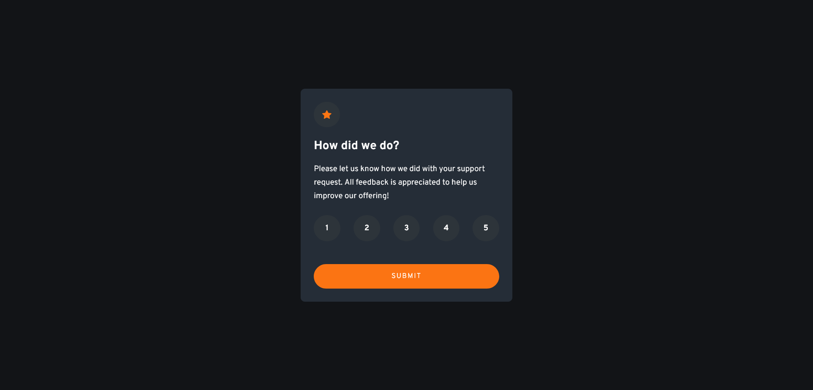

# Frontend Mentor - Interactive rating component solution

This is a solution to the [Interactive rating component challenge on Frontend Mentor](https://www.frontendmentor.io/challenges/interactive-rating-component-koxpeBUmI). Frontend Mentor challenges help you improve your coding skills by building realistic projects. 

## Table of contents

- [Overview](#overview)
  - [The challenge](#the-challenge)
  - [Screenshot](#screenshot)
  - [Links](#links)
- [My process](#my-process)
  - [Built with](#built-with)
  - [What I learned](#what-i-learned)
  - [Continued development](#continued-development)
  - [Useful resources](#useful-resources)
- [Author](#author)

## Overview

An interactive rating component with raw HTML, CSS & Vanilla JavaScript

### The challenge

Users should be able to:

- View the optimal layout for the app depending on their device's screen size
- See hover states for all interactive elements on the page
- Select and submit a number rating
- See the "Thank you" card state after submitting a rating

### Screenshot

### Links

- Solution URL: [here](https://github.com/pilatech/interactive-rating-component)
- Live Site URL: [here](https://interactive-rating-component-by-pilate.netlify.app/)

## My process
 - Thought of how my markup would look based on desktop layout ( with mobile layout still in mind)
 - Created markup based on semantics ( with visual appearance still in mind but not being the main focus)
 - Wrote CSS for mobile first then fixed where desktop didn't fit well later
 - Wrote JavaScript at last

### Built with

- Semantic HTML5 markup
- CSS custom properties
- Flexbox
- Mobile-first workflow

### What I learned

Learnt the proper use of some html elements such as i per the HTML specs

### Continued development

Writing further CSS until it becomes second nature

### Useful resources

- [HTML Specs](https://html.spec.whatwg.org) - It is good for confirming whether you are using a certain HTML element the right way or not.

## Author
- Frontend Mentor - [@pilatech](https://www.frontendmentor.io/profile/pilatech)
- Twitter - [@pchinyengetere](https://www.twitter.com/pchinyengetere)

